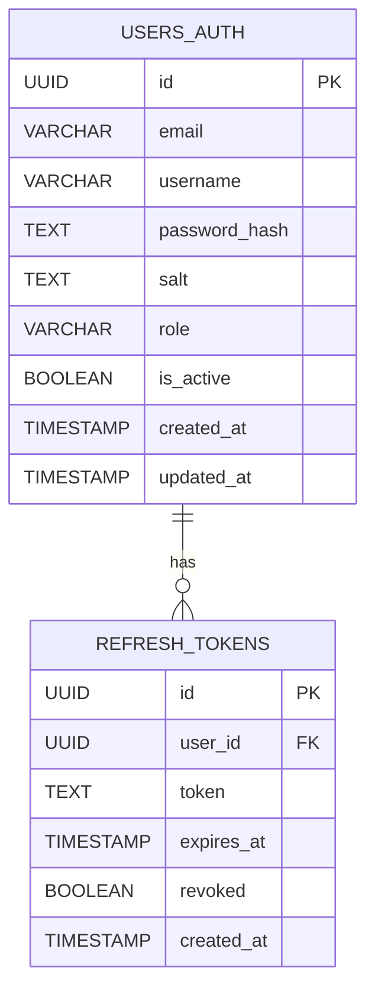

# Auth Service - Database Schema

## 1. Overview
The Auth Service database is focused only on **credentials, identity linkage, and tokens**.  
It does not store full user profiles (handled by User Service).  

Main tables:
- `users_auth` → store authentication credentials.
- `refresh_tokens` → manage refresh tokens for session control.

---

## 2. Tables

### 2.1 users_auth
Stores minimal user credentials for authentication.

| Column         | Type        | Constraints                     | Description                        |
|----------------|------------|---------------------------------|------------------------------------|
| id             | UUID (PK)  | Primary key                     | Unique identifier for the user     |
| email          | VARCHAR    | Unique, Not Null                | Login identity                     |
| username       | VARCHAR    | Unique, Nullable                | Optional username                   |
| password_hash  | TEXT       | Not Null                        | Hashed password (bcrypt/argon2)    |
| salt           | TEXT       | Optional                        | Salt for hashing (if used)         |
| role           | VARCHAR    | Default: "user"                 | Role for authorization (user/admin)|
| is_active      | BOOLEAN    | Default: true                   | Account status                     |
| created_at     | TIMESTAMP  | Default: now()                  | Creation time                      |
| updated_at     | TIMESTAMP  | Auto-update on change           | Last update time                   |

---

### 2.2 refresh_tokens
Stores refresh tokens for session management.  
Enables token revocation (logout, compromised sessions).

| Column      | Type        | Constraints               | Description                   |
|-------------|------------|---------------------------|-------------------------------|
| id          | UUID (PK)  | Primary key               | Unique identifier             |
| user_id     | UUID (FK)  | References `users_auth.id`| Owner of the token            |
| token       | TEXT       | Unique, Not Null          | Stored refresh token string   |
| expires_at  | TIMESTAMP  | Not Null                  | Expiration time               |
| revoked     | BOOLEAN    | Default: false            | Whether token is revoked      |
| created_at  | TIMESTAMP  | Default: now()            | Creation time                 |

---

## 3. Relationships (ERD)

---

## 4. Notes
- `password_hash` must be hashed using **bcrypt** or **argon2**, never plain text.
- `refresh_tokens` table enables secure logout and session revocation.
- `role` is kept simple (user, admin). Fine-grained permissions can be introduced in a future `permissions` table.
- All tables should have proper indexes on `email`, `token`, and `user_id` for performance.
