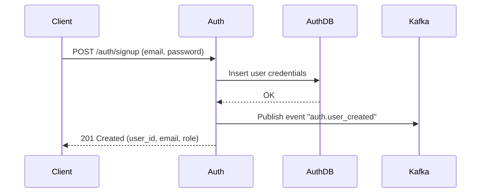
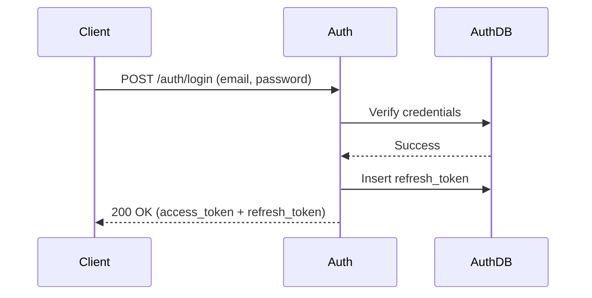
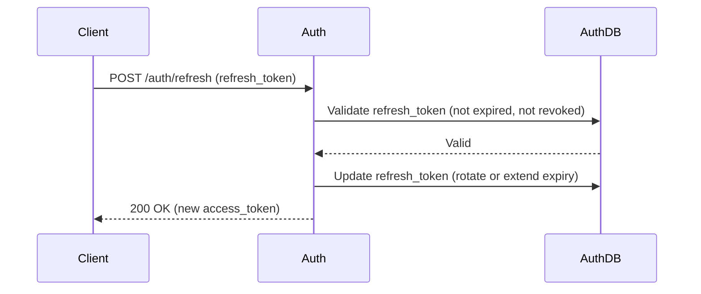
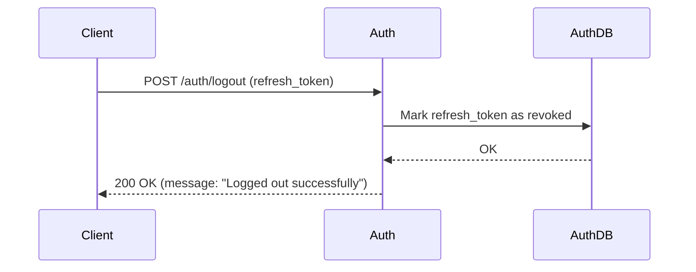
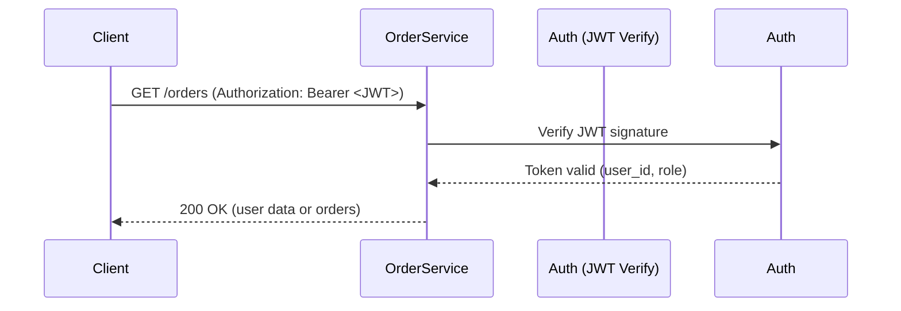

# Auth Service - Flows

## 1. Signup Flow
User registers with email + password.  
Auth creates credentials and publishes event `auth.user_created`.

---

## 2. Login Flow
User provides credentials → Auth validates → returns JWT (access + refresh token).

---

## 3. Refresh Token Flow
Client exchanges refresh token for a new access token.

---

## 4. Logout Flow
Client revokes a refresh token (logout from one session).

---

## 5. Me (Get Current User)
Client uses access token to retrieve user identity from JWT (no DB call).

---

## Notes
- **Signup** may trigger `User Service` (via event) to create an empty profile.
- **JWT verification** should be stateless (using shared secret or public/private key).
- **Refresh token** allows long-lived sessions without keeping access token forever.
